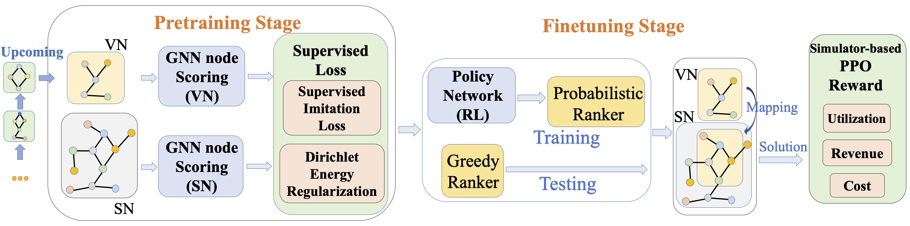

<h1 align="center"><b>GAL-VNE</b></h1>
<p align="center">
    <a href="https://dl.acm.org/doi/10.1145/3580305.3599358"></a>
    <a href="https://github.com/Thinklab-SJTU/GAL-VNE/pulls"></a>
    <a href="https://github.com/Thinklab-SJTU/GAL-VNE/blob/main/LICENSE"></a>
    <a href="https://github.com/Thinklab-SJTU/GAL-VNE/stargazers"></a>
</p>

Official Implementation of KDD 2023 paper:    
"GAL-VNE: Solving the VNE Problem with Global Reinforcement Learning and Local One-Shot Neural Prediction"

## VNE Problem

The NP-hard combinatorial Virtual Network Embedding (VNE) Problem refers to finding the node and edge mapping between a virtual network (VN) and the substrate network (SN).

## GAL-VNE    
We propose **G**lobal-**A**nd-**L**ocal VNE framework (GAL-VNE) by a pretrain-then-finetune training paradigm.    
For more details, please see this [project](https://hygeng.top/publication/2023kdd-vnep/).




### Requirements    
```
easydict==1.10    
gym==0.26.2    
Jinja2==3.1.2    
matplotlib==3.8.3    
networkx==3.0    
numpy==1.23.5    
ortools==9.4.1874    
pandas==2.2.2    
PyYAML==6.0    
scikit_learn==1.2.2    
scipy==1.13.0    
torch==1.12.1    
torch_geometric==2.2.0    
tqdm==4.64.1    
```

### Specify configurations
Customize "--pn_setting_path" and "--vns_setting_path".    
The default setting is:
```
--pn_setting_path=settings/pn_setting/pn_setting.yaml --vns_setting_path=settings/vns_setting/vns_setting.yaml
```

| **Parameters**                    | **SN**        | **VN**         |
|-----------------------------------|---------------|----------------|
| **Number of SN**                  | 1             | 2000           |
| **Number of Nodes**               | 100           | $2 \sim 10$    |
| **Number of Links**               | 500           | $Random(0.5)$  |
| **Node CPU (uniform dist.)**      | $50 \sim 100$ | $0 \sim 50$    |
| **Bandwidth (uniform dist.)**     | $50 \sim 100$ | $0 \sim 50$    |
| **Arrival Time (Possion dist.)**  | -             | $Poisson(0.1)$ |
| **Life Time (exponential dist.)** | -             | $Exp(500) $    |

The setting VN dataset during training is specified in "--vns_sub_setting_path".    

### Generate data
Run any solver with:
```
--generate_vn --generate_pn
```
Remind that generate the dataset once, and keep fixed afterwards. The default dataset is put in "dataset/" folder.

### Reproduce the results

```
bash run.sh
```

## Citation

If you find our work useful in your research, please consider citing:

```bibtex
@inproceedings{geng2023galvne,
    author = {Geng, Haoyu and Wang, Runzhong and Wu, Fei and Yan, Junchi},
    title = {GAL-VNE: Solving the VNE Problem with Global Reinforcement Learning and Local One-Shot Neural Prediction},
    year = {2023},
    isbn = {9798400701030},
    publisher = {Association for Computing Machinery},
    address = {New York, NY, USA},
    url = {https://doi.org/10.1145/3580305.3599358},
    doi = {10.1145/3580305.3599358},
    booktitle = {Proceedings of the 29th ACM SIGKDD Conference on Knowledge Discovery and Data Mining},
    pages = {531–543},
    numpages = {13},
    keywords = {combinatorial optimization, virtual network embedding, reinforcement learning},
    location = {Long Beach, CA, USA},
    series = {KDD '23}
}
```
## Acknowledgement    
We sincerely thank the repository [virne](https://github.com/GeminiLight/virne) for their well-implemented pipeline upon which we build our codebase.